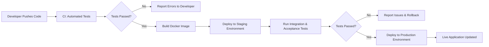

# airbnb-clone-project

## 👥 Team Roles

### **Backend Developer**

The Backend Developer is responsible for designing and implementing the server-side logic of the application. This includes building and maintaining RESTful and GraphQL APIs using Django and Django REST Framework, handling authentication and authorization, managing data models, and ensuring smooth integration between the frontend and backend. They also collaborate closely with the Database Administrator and DevOps Engineer to ensure reliability, scalability, and performance.

### **Database Administrator (DBA)**

The Database Administrator manages the design, implementation, and optimization of the PostgreSQL database. Their responsibilities include defining efficient database schemas, setting up indexing for performance optimization, handling data migrations, managing backups, and ensuring data integrity and security. The DBA also collaborates with developers to fine-tune queries and caching mechanisms using Redis.

### **DevOps Engineer**

The DevOps Engineer ensures that the development and deployment processes are automated, reliable, and scalable. They configure Docker containers for consistent environments, set up CI/CD pipelines for seamless integration and deployment, and monitor system performance. Their role also involves managing the cloud infrastructure, optimizing deployment workflows, and implementing security and recovery measures.

### **QA Engineer**

The QA Engineer is in charge of maintaining the quality and stability of the system. They develop and execute automated and manual test plans to ensure all backend functionalities meet the project’s requirements. Their tasks include API testing, performance testing, and validating booking, payment, and review features. The QA Engineer collaborates with developers to identify, report, and resolve issues early in the development lifecycle.

## ⚙️ Technology Stack

### **Django**

A high-level Python web framework used to build the backend of the application. It provides robust features for rapid development, including ORM, authentication, and an admin interface, making it ideal for creating RESTful APIs and handling business logic.

### **Django REST Framework (DRF)**

An extension of Django that simplifies the creation of RESTful APIs. It provides tools for serialization, authentication, permissions, and viewsets, ensuring smooth interaction between the frontend and backend.

### **PostgreSQL**

A powerful open-source relational database used for storing structured data such as users, properties, bookings, payments, and reviews. It supports advanced indexing and query optimization for efficient data retrieval.

### **GraphQL**

A flexible query language that allows clients to request only the data they need. It provides a more efficient and precise alternative to REST, improving frontend-backend communication and performance.

### **Celery**

A distributed task queue used for handling asynchronous background tasks, such as sending email notifications, processing payments, and scheduling periodic jobs without blocking the main application flow.

### **Redis**

An in-memory data store used for caching and session management. It helps reduce database load and improve response times by temporarily storing frequently accessed data.

### **Docker**

A containerization tool that packages the application and its dependencies into portable containers. It ensures consistent environments across development, testing, and production.

### **CI/CD Pipelines**

Automated Continuous Integration and Continuous Deployment pipelines are used to test, build, and deploy code changes efficiently. They help maintain code quality, speed up releases, and minimize human error during deployment.

## 🗄️ Database Design

The database is designed using **PostgreSQL** to store and manage all application data efficiently.  
It follows a **relational model** to maintain data integrity and ensure efficient querying.  
Below are the key entities and their relationships.

---

### **1. Users**

Represents all registered users in the system — both hosts and guests.

**Key Fields:**

- `id` – Unique identifier for each user.
- `username` – User’s unique login name.
- `email` – User’s email address for authentication and notifications.
- `password` – Encrypted password for account security.
- `role` – Defines whether the user is a _host_ or _guest_.

**Relationships:**

- A **user** can list multiple **properties** (as a host).
- A **user** can make multiple **bookings** (as a guest).
- A **user** can leave multiple **reviews**.

---

### **2. Properties**

Represents property listings created by hosts.

**Key Fields:**

- `id` – Unique identifier for the property.
- `title` – Name or title of the property listing.
- `description` – Detailed description of the property.
- `price_per_night` – Cost of booking per night.
- `host_id` – References the **User** who owns the property.

**Relationships:**

- A **property** belongs to one **user** (the host).
- A **property** can have many **bookings**.
- A **property** can have many **reviews**.

---

### **3. Bookings**

Tracks reservations made by guests for specific properties.

**Key Fields:**

- `id` – Unique identifier for each booking.
- `user_id` – References the **User** who made the booking.
- `property_id` – References the **Property** being booked.
- `check_in` – Start date of the booking.
- `check_out` – End date of the booking.
- `status` – Current status (e.g., pending, confirmed, canceled).

**Relationships:**

- A **booking** belongs to one **user** (guest).
- A **booking** belongs to one **property**.
- A **booking** may have one related **payment** record.

---

### **4. Payments**

Records all transactions related to bookings.

**Key Fields:**

- `id` – Unique identifier for each payment.
- `booking_id` – References the **Booking** associated with the payment.
- `amount` – Total amount paid for the booking.
- `payment_method` – Method used (e.g., credit card, PayPal).
- `status` – Status of payment (e.g., success, failed, pending).

**Relationships:**

- A **payment** belongs to one **booking**.
- Each **booking** has one **payment** record.

---

### **5. Reviews**

Stores feedback and ratings from users about properties.

**Key Fields:**

- `id` – Unique identifier for each review.
- `user_id` – References the **User** who wrote the review.
- `property_id` – References the **Property** being reviewed.
- `rating` – Numeric rating (e.g., 1–5).
- `comment` – Textual feedback from the user.

**Relationships:**

- A **review** belongs to one **user**.
- A **review** belongs to one **property**.

---

### **Entity Relationships Summary**

- **User ↔ Property:** One-to-Many (a user can own many properties).
- **User ↔ Booking:** One-to-Many (a user can make many bookings).
- **Property ↔ Booking:** One-to-Many (a property can have many bookings).
- **Booking ↔ Payment:** One-to-One (each booking has one payment).
- **Property ↔ Review:** One-to-Many (a property can have many reviews).
- **User ↔ Review:** One-to-Many (a user can write multiple reviews).

---

The relational structure ensures data integrity and supports efficient queries through foreign key relationships and indexing strategies.

## ✨ Feature Breakdown

This section outlines the main features of the Airbnb Clone backend system.  
Each feature is designed to deliver a seamless user experience while ensuring scalability, security, and performance.

---

### **1. User Management**

Implements a secure system for user registration, authentication, and profile management.  
Users can sign up, log in, update their profiles, and manage their listings or bookings depending on their role (host or guest).  
This feature ensures account security through authentication mechanisms and role-based access control.

---

### **2. Property Management**

Allows hosts to create, update, and manage their property listings.  
Each property includes essential details such as title, description, price, and address (city, state, and country) to support location-based searches.  
This feature ensures hosts can easily manage accommodations while guests can browse available listings efficiently.

---

### **3. Booking System**

Enables guests to reserve properties, manage booking details, and track check-in/check-out dates.  
The system prevents overlapping bookings and maintains accurate availability status for each property.  
This feature provides the foundation for all reservation-related activities in the platform.

---

### **4. Payment Processing**

Handles secure payment transactions associated with bookings.  
Integrates payment gateways to process and record successful transactions, ensuring that both hosts and guests have transparent financial tracking.  
This feature also supports payment status updates such as pending, confirmed, or failed.

---

### **5. Review System**

Allows guests to leave reviews and ratings for properties they’ve stayed in.  
Hosts can receive feedback that helps improve their service quality, while future guests can make informed booking decisions.  
This feature enhances trust and credibility within the platform’s user community.

---

### **6. API Documentation**

All REST and GraphQL endpoints are documented using the **OpenAPI** standard.  
This ensures developers and testers can easily understand, integrate, and test backend services without ambiguity.  
The documentation promotes collaboration and reduces onboarding time for new developers.

---

### **7. Database Optimization**

Optimizes data retrieval and performance using **indexing** and **caching** strategies.  
Frequently accessed data (like property listings or user profiles) is cached using **Redis** to reduce database load.  
This feature ensures high performance and scalability, even under heavy user traffic.

---

### **8. CI/CD and Dockerized Environment**

The entire backend system is containerized using **Docker**, ensuring consistent development and deployment environments.  
Automated **CI/CD pipelines** are implemented to run tests and deploy updates efficiently.  
This feature enhances reliability, reduces manual errors, and enables continuous improvement of the platform.

## 🛡️ API Security

Security is a critical part of this project to protect user data, maintain trust, and prevent unauthorized access.  
The following key measures will be implemented to ensure a secure backend system:

### 🔐 1. Authentication

Every user must log in using secure credentials (email/password) or OAuth (Google, etc.).  
**Implementation:** JSON Web Tokens (JWT) will be used to verify user sessions, sent in request headers for all protected routes.  
**Purpose:** Ensures only legitimate users can access personal accounts or perform sensitive operations such as bookings and payments.

---

### 🧩 2. Authorization

Controls what actions a user can perform based on their role (e.g., Admin, Property Owner, Customer).  
**Implementation:** Role-Based Access Control (RBAC) will be applied to restrict routes and data resources.  
**Purpose:** Prevents users from accessing or modifying data they don’t own — for example, a user cannot manage another user’s property or bookings.

---

### 🔒 3. Data Encryption

Sensitive information such as passwords and payment details will be encrypted before storage or transmission.  
**Implementation:** Passwords will be hashed using **bcrypt**, and HTTPS will be enforced for all communications.  
**Purpose:** Protects confidential data even if a database breach or network interception occurs.

---

### ⚙️ 4. Rate Limiting

Limits the number of requests a client can make within a specific time period.  
**Implementation:** Middleware such as **express-rate-limit** will be used to prevent brute-force and denial-of-service (DoS) attacks.  
**Purpose:** Prevents system overload and malicious access attempts.

---

### 🧼 5. Input Validation and Sanitization

Ensures all incoming user data is properly validated and sanitized.  
**Implementation:** Libraries like **Joi** or **Validator.js** will be used to prevent injection attacks (e.g., SQL Injection, XSS).  
**Purpose:** Protects the system from harmful or malformed inputs that could compromise security.

---

### 💳 6. Secure Payments

All payment transactions will be processed through trusted third-party payment gateways (e.g., Stripe, PayPal).  
**Implementation:** Use encrypted communication and tokenized transactions for all financial operations.  
**Purpose:** Ensures sensitive payment data is never directly handled or stored by the server.

---

## ⚡ CI/CD Pipeline

Continuous Integration (CI) and Continuous Deployment/Delivery (CD) are practices that automate the process of testing, building, and deploying code.  
A **CI/CD pipeline** ensures that code changes are automatically tested and deployed in a consistent, reliable, and efficient manner.

**Importance for the Project:**

- **Automated Testing:** Ensures that every code change is tested before merging, reducing bugs and improving quality.
- **Faster Deployment:** Updates can be deployed automatically without manual intervention, enabling frequent releases.
- **Consistency:** Guarantees that the application runs the same way in development, staging, and production environments.
- **Collaboration:** Helps multiple developers work together safely by integrating changes continuously.

**Tools That Can Be Used:**

- **GitHub Actions:** Automates workflows for testing, building, and deploying the project.
- **Docker:** Provides consistent containerized environments for development and deployment.
- **Celery + Redis:** For background tasks and asynchronous processing during deployment or build pipelines.
- **PostgreSQL:** Ensures database migrations and updates are smoothly integrated in CI/CD workflows.

### ⚡ CI/CD Pipeline Flow

